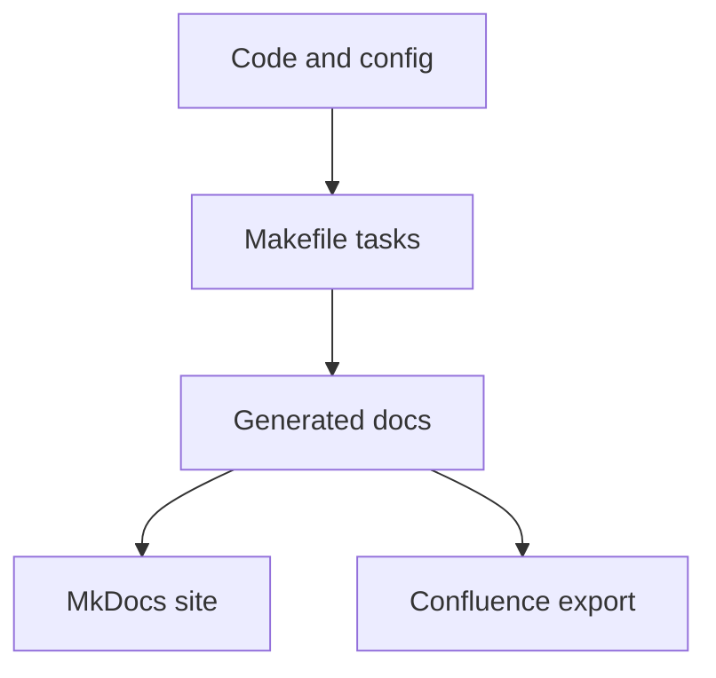

# Architecture

High-level repository view.

```mermaid
flowchart TD
    A[Code and config] --> B[Makefile tasks]
    B --> C[Generated docs]
    C --> D[MkDocs site]
    C --> E[Confluence export]
```

## Generated Make dependency flow

### SVG view

### Mermaid view

```mermaid
--8<-- "docs/generated/makeflow.mmd"
```
