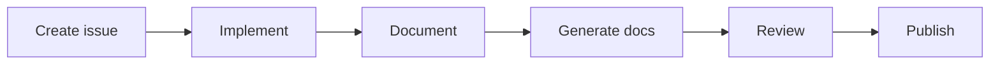

## `docs/workflow.md`

### Workflow

Typical project flow:

```mermaid
flowchart LR
    A[Create issue] --> B[Implement]
    B --> C[Document]
    C --> D[Generate docs]
    D --> E[Review]
    E --> F[Publish]
```

### Notes

Add migration steps, runbook flow, or upgrade sequence here.

