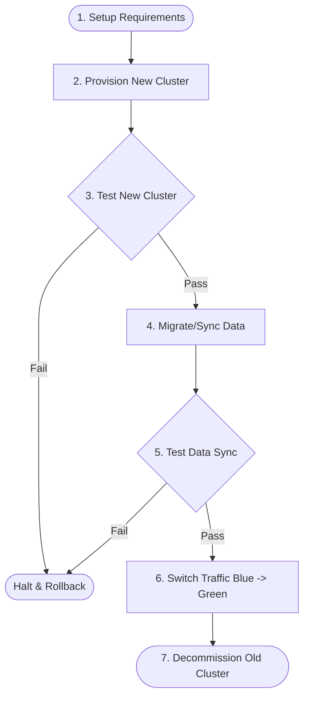
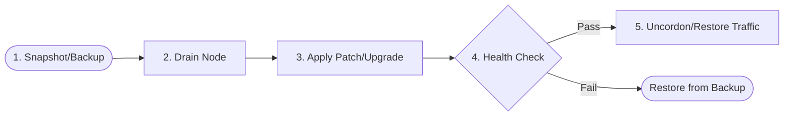
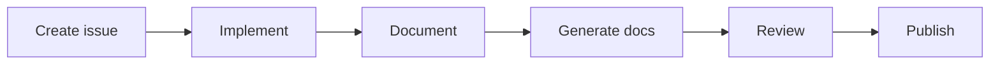

# Workflow for {{ cookiecutter.project_name }}

This document outlines the standard operating procedure for this infrastructure project.


### Blue/Green Deployment Flow

### Execution Steps
- [ ] Verify prerequisites and access.
- [ ] Provision the new isolated environment.
- [ ] Run automated tests against the new environment.
- [ ] Initiate the data replication/sync mechanism.
- [ ] Validate data integrity on the new cluster.
- [ ] Flip the DNS/Load Balancer to route traffic to the new cluster.
- [ ] Wait for TTL/Drain period, then destroy the old cluster.


### In-Place Upgrade Flow

### Execution Steps
- [ ] Take a full disk snapshot or database backup.
- [ ] Drain connections from the target node.
- [ ] Execute the upgrade package.
- [ ] Verify application health locally.
- [ ] Add the node back into the load balancer rotation.


### Standard Project Flow

### Execution Steps
- [ ] Open a tracking ticket.
- [ ] Write the infrastructure code.
- [ ] Update these documentation files.
- [ ] Submit a Pull Request for review.


